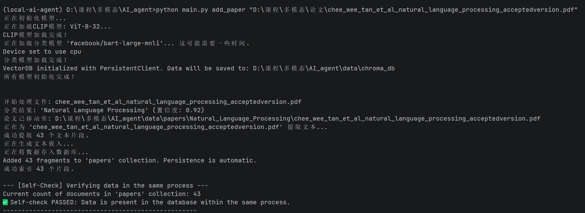
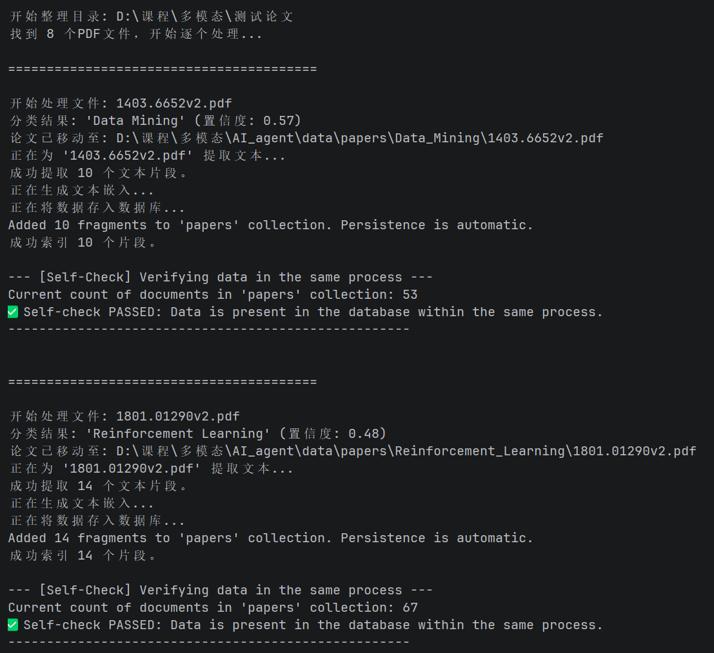
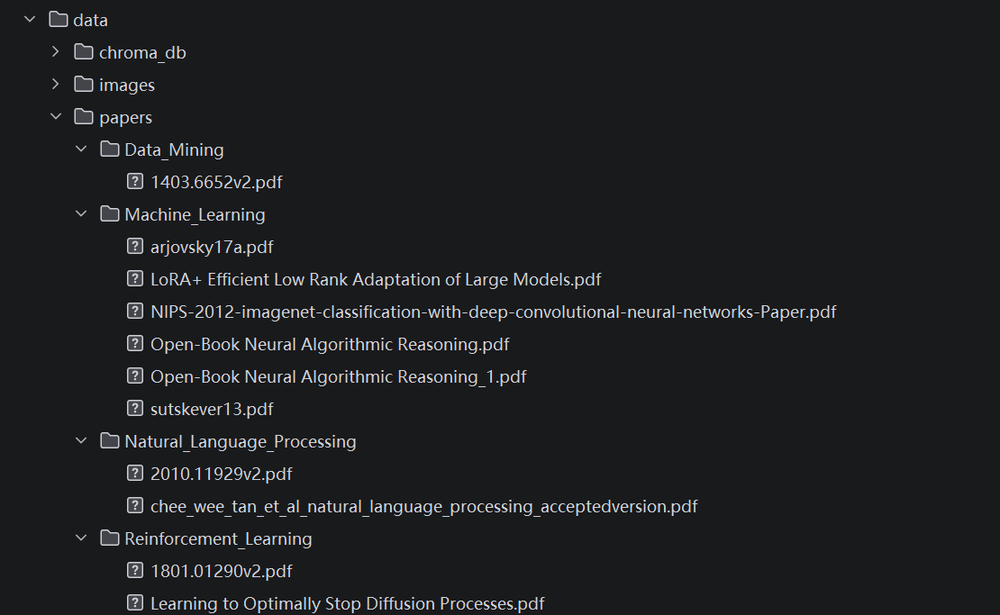
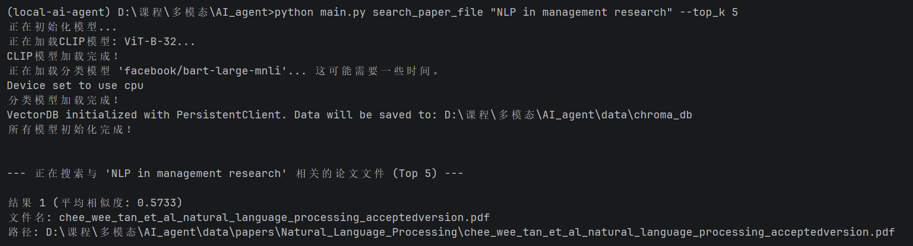
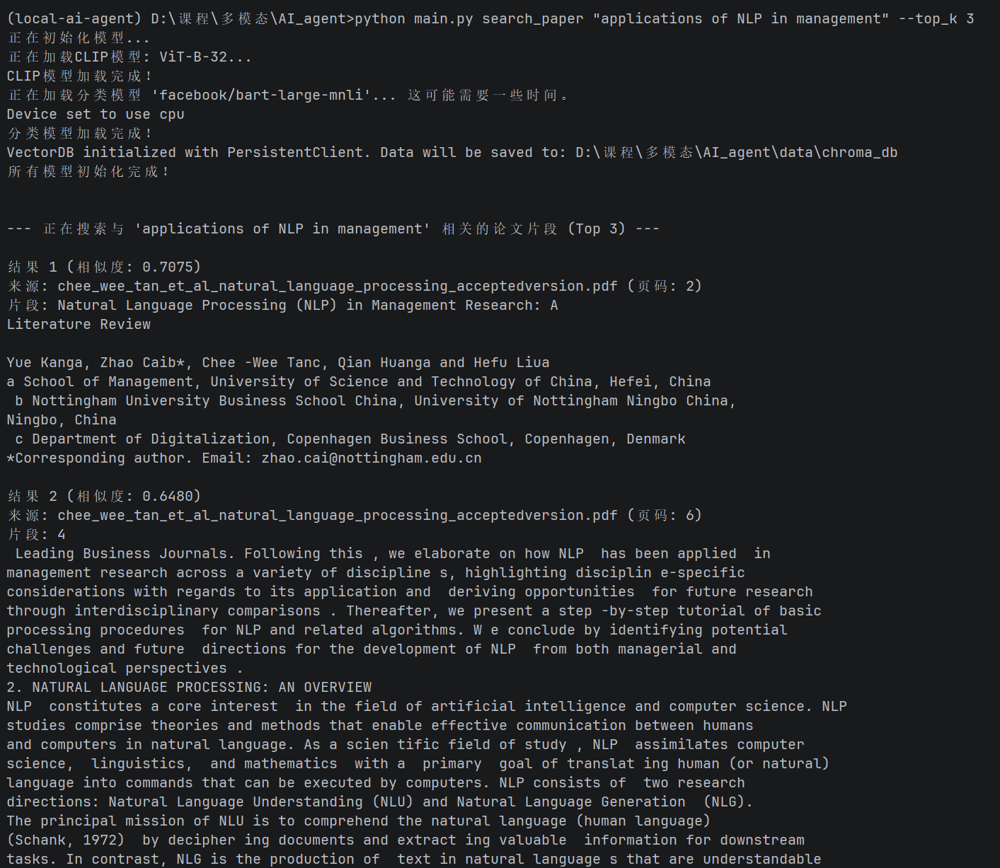
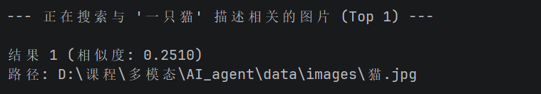
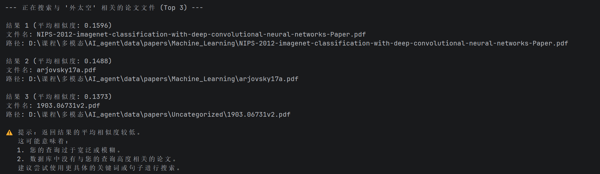

# 本地多模态AI文献管理助手

## 项目简介
本项目是一款**本地运行的多模态AI文献管理工具**，支持学术论文的自动分类、语义搜索，以及图片的以文搜图功能。所有数据（论文、图片、向量索引）均存储在本地，无需联网即可使用，保障数据隐私与使用便捷性。


## 核心功能列表
- **论文管理**：
  1. 单篇论文添加：自动提取论文信息、分类到对应主题文件夹、生成文本嵌入并索引
  2. 批量整理论文：对指定文件夹内的所有PDF论文进行一键分类、移动与索引
- **论文搜索**：
  1. 搜索论文文件：根据语义查询返回相关的论文文件列表
  2. 搜索论文片段：根据查询返回论文内的精准文本片段及页码
- **图片管理**：
  1. 添加图片索引：上传图片并生成多模态嵌入
  2. 以文搜图：根据文本描述返回最相似的本地图片
- **本地存储**：所有数据（论文、图片、向量数据库）均保存在项目 `data/` 目录下


## 环境配置与依赖安装
### 1. 虚拟环境激活
请先激活项目开发使用的虚拟环境（示例为 `local-ai-agent`）：
```bash
# Conda虚拟环境
conda activate local-ai-agent

# Venv虚拟环境（Windows）
local-ai-agent\Scripts\activate

# Venv虚拟环境（mac/Linux）
source local-ai-agent/bin/activate
```

### 2. 依赖安装
项目依赖已导出至 `requirements.txt`，执行以下命令安装（使用清华源加速）：
```bash
pip install -r requirements.txt -i https://pypi.tuna.tsinghua.edu.cn/simple
```


## 使用说明
项目支持**命令行调用**（符合作业评测接口规范）与**Streamlit图形界面**两种使用方式。


### 方式1：命令行调用（main.py统一入口）
项目根目录下的 `main.py` 为统一入口，支持以下核心功能调用：

#### （1）添加并分类单篇论文
```bash
python main.py add_paper <PDF文件路径>
# 示例：
python main.py add_paper "D:\课程\多模态\论文\example_paper.pdf"
```

#### （2）批量整理论文文件夹
```bash
python main.py organize_papers <论文文件夹路径>
# 示例：
python main.py organize_papers "D:\课程\多模态\待整理论文"
```

#### （3）搜索相关论文文件（整篇）
```bash
python main.py search_paper_file <查询关键词> --top_k <返回数量>
# 示例：
python main.py search_paper_file "NLP在管理领域的应用" --top_k 5
```

#### （4）搜索论文精准片段
```bash
python main.py search_paper <查询关键词> --top_k <返回数量>
# 示例：
python main.py search_paper "Transformer模型的语义编码" --top_k 3
```

#### （5）添加并索引单张图片
```bash
python main.py add_image <图片文件路径>
# 示例：
python main.py add_image "D:\课程\多模态\图片\sunset.jpg"
```

#### （6）以文搜图
```bash
python main.py search_image <图片描述关键词> --top_k <返回数量>
# 示例：
python main.py search_image "海边日落的风景图" --top_k 2
```


### 方式2：Streamlit图形界面（可视化操作）
项目根目录下的 `app.py` 提供更友好的图形界面，执行以下命令启动：
```bash
streamlit run app.py
```
启动后会自动在浏览器打开界面，左侧侧边栏选择功能（添加论文、搜索、图片管理），按界面提示操作即可。


## 技术选型说明
| 模块          | 技术/工具                          | 用途                                  |
|---------------|------------------------------------|---------------------------------------|
| 文本嵌入模型  | Sentence-Transformers（all-MiniLM-L6-v2） | 论文文本、搜索查询的向量编码          |
| 图像嵌入模型  | CLIP（ViT-B-32）                   | 图片、文本描述的多模态向量编码        |
| 论文分类模型  | BART-Large-MNLI                    | 根据论文标题/摘要自动分类到主题文件夹 |
| 向量数据库    | ChromaDB                           | 存储文本/图片的向量索引，支持语义搜索 |
| PDF处理       | PyPDF2                             | 提取论文文本与页码信息                |
| 图像处理      | Pillow                             | 图片加载与格式转换                    |
| 可视化界面    | Streamlit                          | 提供图形化操作入口                    |


## 演示文档内容
### 1. 运行截图
- **截图1：添加论文后的处理日志**
  
- **截图2：批量处理论文后的处理日志**
  
- **截图3：分类后的文件夹结构**
  
- **截图4：整篇论文搜索结果**
  
- **截图5：论文片段搜索结果**
  
- **截图6：以文搜图结果**
  
- **截图7：边界测试**
  


### 2. 演示视频
演示视频在邮件的附件中。


## 注意事项
- 所有数据默认存储在项目根目录的 `data/` 文件夹下（论文：`data/papers/`；图片：`data/images/`；向量索引：`data/chroma_db/`）
- 首次运行功能时，模型会自动下载（需确保网络可访问Hugging Face，或提前手动下载模型到本地缓存）